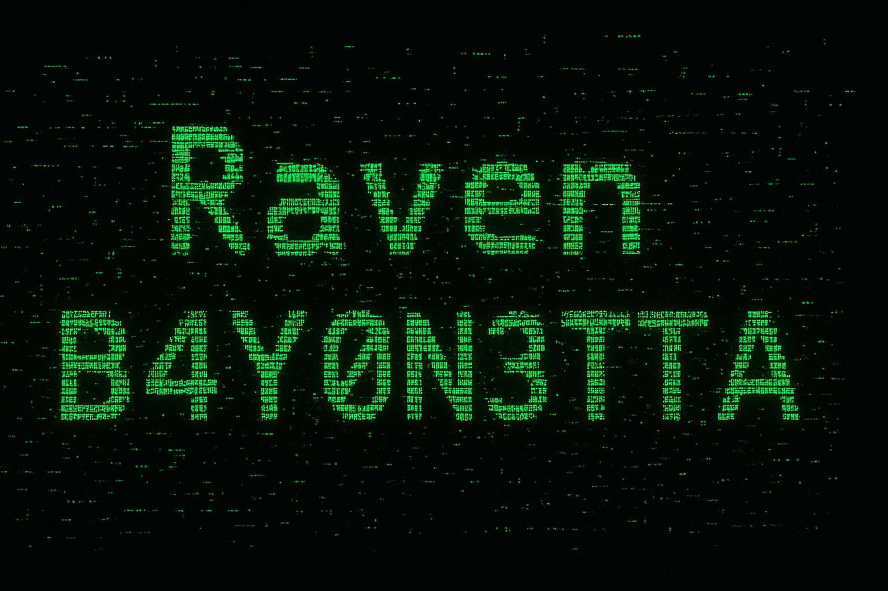

🏤 Studying Information Technology at TIP Manila  
 🛡️ B4Y0N3TTA, Defender of the Digital Realm  
 🔐 Trains through CTF competitions and hackathons  
 📚 Constantly forging new tech and cybersecurity skills  

---

# 🛡️ Toolkit

 

  

# 💻 Tech Stack
 
 

  

 
 
 

 
 
 
 

---

# 🌐 Socials

 
 

---

# 📊 GitHub Stats

 
 

---

<!-- Proudly created with GPRM ( https://gprm.itsvg.in ) -->
